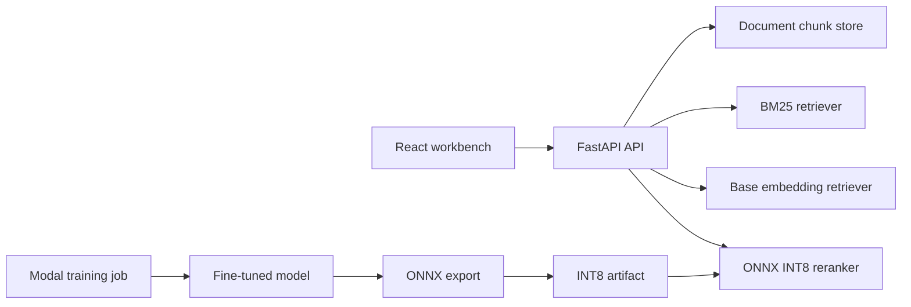

# Semantic Reranker Search

A recruiter-facing semantic search project that compares keyword retrieval, base embedding search, and a fine-tuned ONNX INT8 model.

Users can paste or upload product docs, FAQs, or job listings, then query the corpus and compare ranked results across retrieval modes.

## What This Demonstrates

- **Train:** remote Sentence Transformer fine-tuning on Modal.
- **Optimize:** ONNX export and INT8 quantization.
- **Deploy:** FastAPI, React, Docker, and Render.
- **Evaluate:** Recall@5, P95 latency, and model size benchmarks.
- **Integrate:** document chunking, search API, benchmark UI, and model artifact loading.

## Architecture



## Project Structure

```text
backend/app/          FastAPI app, retrieval, metrics, chunking
backend/tests/        Unit and API tests
frontend/src/         React search workbench
modal/train.py        Remote Modal training/export/quantization job
scripts/              Dataset generation and benchmark scripts
artifacts/            Downloaded model and benchmark artifacts
data/                 Generated training pairs
```

## Local Development

Install backend dependencies:

```bash
cd /Users/jahnaviyelamanchi/Documents/semantic-reranker-search
python -m venv .venv
source .venv/bin/activate
pip install -r backend/requirements.txt
```

Run the API:

```bash
uvicorn app.main:app --app-dir backend --reload
```

Run the React app:

```bash
cd frontend
npm install
npm run dev
```

By default, the API starts with example documents so the UI can search immediately. Before Modal artifacts exist, `finetuned` mode falls back to deterministic semantic search and returns an artifact status message.

## Generate Data

```bash
python scripts/generate_dataset.py --count 1000 --out data/training_pairs.jsonl
```

The generated dataset uses product-doc, FAQ, and job-listing examples with positive and negative query-document pairs.

## Train On Modal

Training is intentionally remote-only.

```bash
pip install modal
modal setup
modal run modal/train.py --max-examples 1000 --epochs 1
```

The Modal job:

1. builds synthetic query-document pairs,
2. fine-tunes `sentence-transformers/all-MiniLM-L6-v2`,
3. saves model artifacts to a Modal Volume,
4. exports ONNX,
5. writes `model-int8.onnx` with dynamic INT8 quantization.

Download artifacts from the Modal Volume into `artifacts/` before benchmarking or deployment.

Expected artifact paths:

```text
artifacts/model-int8.onnx
artifacts/metrics.json
```

## Benchmark

```bash
python scripts/generate_dataset.py --count 1000
python scripts/evaluate.py --pairs data/training_pairs.jsonl --out artifacts/metrics.json --limit 100
```

The benchmark script writes rows consumed by both the API and UI:

| Model | Recall@5 | P95 latency | Size |
| --- | ---: | ---: | ---: |
| BM25 | measured locally | measured locally | - |
| Base embedding model | measured locally | measured locally | model dependent |
| Fine-tuned ONNX INT8 | measured locally | measured locally | artifact dependent |

Replace this table with measured values after the first Modal training run.

## Test

```bash
pytest
```

Tests cover chunking, BM25 retrieval, embedding retrieval fallback, API health, document ingestion, search, and metrics shape.

## Docker

```bash
docker build -t semantic-reranker-search .
docker run --rm -p 8000:8000 semantic-reranker-search
```

The Docker image builds the React app, serves it from FastAPI, and exposes `/health` for Render.

## Render Deployment

1. Push this repo to GitHub.
2. Create a Render Blueprint from `render.yaml`, or create a Docker web service manually.
3. Set the health check path to `/health`.
4. Include `artifacts/model-int8.onnx` before deployment if you want ONNX INT8 mode available on first boot.

## API

### `POST /documents`

```json
{
  "title": "Product FAQ",
  "text": "Refunds are available within 14 days..."
}
```

### `POST /search`

```json
{
  "query": "How do refunds work?",
  "mode": "bm25",
  "top_k": 5
}
```

Modes: `bm25`, `base`, `finetuned`.

### `GET /metrics`

Returns benchmark rows for the UI and README table.

### `GET /health`

Render health check endpoint.

## Current Scope

This is a one-day MVP. It intentionally skips authentication, payments, teams, persistent multi-user storage, and complex ingestion pipelines.

