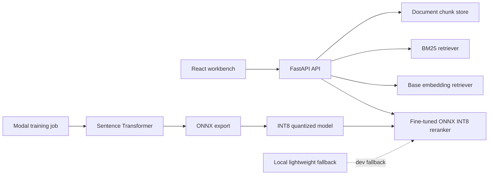

# Semantic Reranker Search

A semantic search application for comparing keyword retrieval, embedding search, and an ONNX INT8 reranker.

Users can paste or upload product docs, FAQs, or job listings, then query the corpus and compare ranked results across retrieval modes.

## Features

- Document chunking and in-memory indexing
- BM25 keyword search
- Embedding-based retrieval
- ONNX Runtime reranking with an INT8 quantized encoder
- Benchmark reporting for Recall@5, P95 latency, and artifact size
- FastAPI service with a React dashboard

## Architecture



## Project Structure

```text
backend/app/          FastAPI app, retrieval, metrics, chunking
backend/tests/        Unit and API tests
frontend/src/         React search workbench
modal/train.py        Remote Modal training/export/quantization job
scripts/              Dataset generation and benchmark scripts
artifacts/            Downloaded model and benchmark artifacts
data/                 Generated training pairs
```

## Local Development

Install backend dependencies:

```bash
cd /Users/jahnaviyelamanchi/Documents/semantic-reranker-search
python -m venv .venv
source .venv/bin/activate
pip install -r backend/requirements.txt
```

Run the API:

```bash
uvicorn app.main:app --app-dir backend --reload
```

Run the React app:

```bash
cd frontend
npm install
npm run dev
```

If the frontend is running separately from the API, set `VITE_API_BASE=http://localhost:8000` in `frontend/.env.local`.

Shortcut commands:

```bash
make api
make frontend
make test
make data
make train-lightweight
make benchmark
make modal-train
make modal-download
```

By default, the API starts with example documents so the UI can search immediately. The checked-in ONNX INT8 model and tokenizer power `finetuned` mode.

## Generate Data

```bash
python scripts/generate_dataset.py --count 1000 --out data/training_pairs.jsonl
```

The generated dataset uses product-doc, FAQ, and job-listing examples with positive and negative query-document pairs.

## Train

The full training path runs on Modal:

```bash
make data
pip install modal
modal setup
make modal-train
make modal-download
make benchmark
```

The Modal job:

1. builds query-document training pairs,
2. trains `sentence-transformers/all-MiniLM-L6-v2`,
3. saves model artifacts to a Modal Volume,
4. exports the trained encoder to ONNX,
5. writes `model-int8.onnx` with dynamic INT8 quantization,
6. saves tokenizer files required by ONNX Runtime serving.

There is also a fast local fallback trainer for development:

```bash
make train-lightweight
```

Expected artifact paths:

```text
artifacts/model-int8.onnx
artifacts/tokenizer/
artifacts/metrics.json
artifacts/modal_metrics.json
artifacts/lightweight-reranker-int8.json  # fallback only
```

## Benchmark

```bash
python scripts/generate_dataset.py --count 1000
python scripts/evaluate.py --pairs data/training_pairs.jsonl --out artifacts/metrics.json --limit 100
```

The benchmark script writes rows consumed by both the API and UI:

| Model | Recall@5 | P95 latency | Size |
| --- | ---: | ---: | ---: |
| BM25 | 0.200 | 0.49 ms | - |
| Base embedding model | 0.340 | 531.98 ms | - |
| Fine-tuned ONNX INT8 reranker | 0.270 | 8.26 ms | 21.89 MB |

These are measured numbers from `artifacts/metrics.json` after Modal training, ONNX export, INT8 quantization, and local benchmarking.

## Test

```bash
pytest
```

Tests cover chunking, BM25 retrieval, embedding retrieval fallback, API health, document ingestion, search, and metrics shape.

## Docker

```bash
docker build -t semantic-reranker-search .
docker run --rm -p 8000:8000 semantic-reranker-search
```

The Docker image builds the React app, serves it from FastAPI, and exposes `/health` for Render.

## Render Deployment

1. Push this repo to GitHub.
2. Create a Render Blueprint from `render.yaml`, or create a Docker web service manually.
3. Set the health check path to `/health`.
4. The ONNX INT8 model and tokenizer are included in `artifacts/` for deployment.

## API

### `POST /documents`

```json
{
  "title": "Product FAQ",
  "text": "Refunds are available within 14 days..."
}
```

### `POST /search`

```json
{
  "query": "How do refunds work?",
  "mode": "bm25",
  "top_k": 5
}
```

Modes: `bm25`, `base`, `finetuned`.

### `GET /metrics`

Returns benchmark rows for the UI and README table.

### `GET /artifacts`

Returns model artifact availability and sizes for the ONNX INT8 model, tokenizer, and local fallback artifact.

### `GET /health`

Render health check endpoint.
